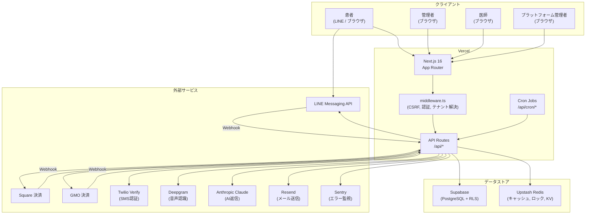
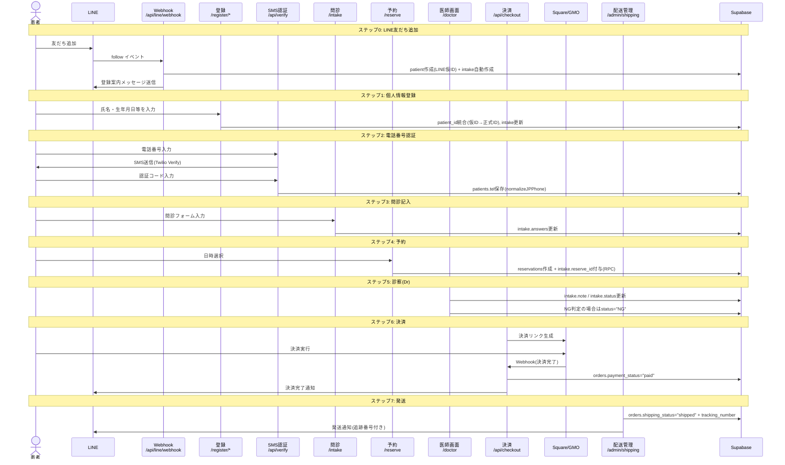
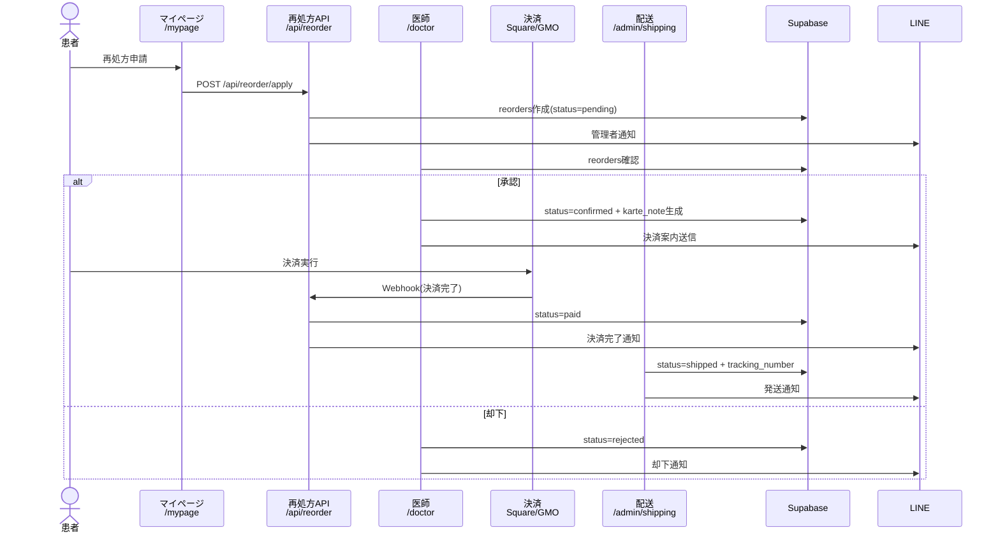
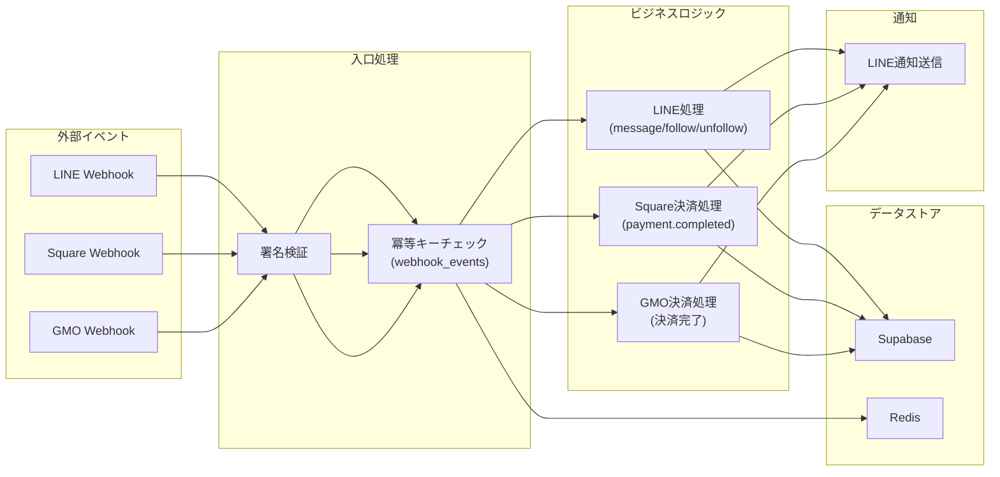
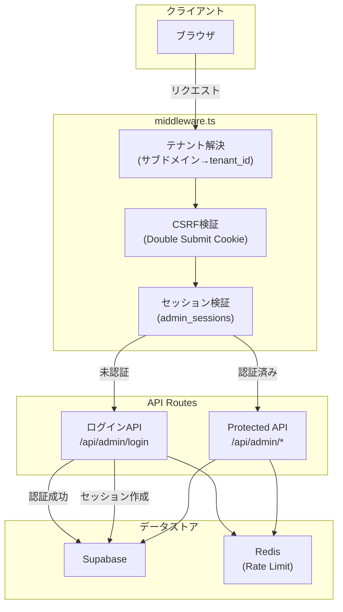
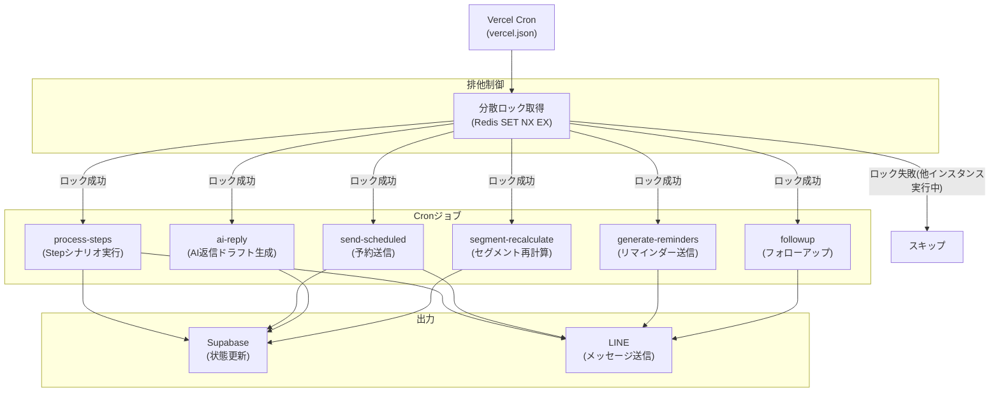
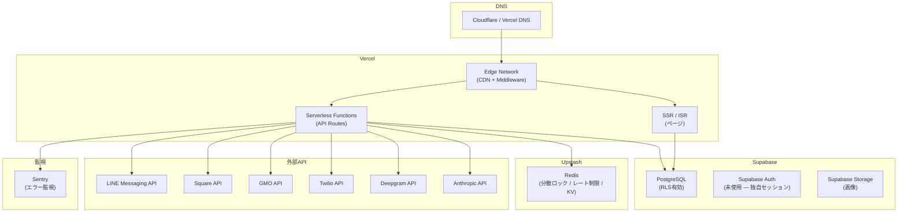
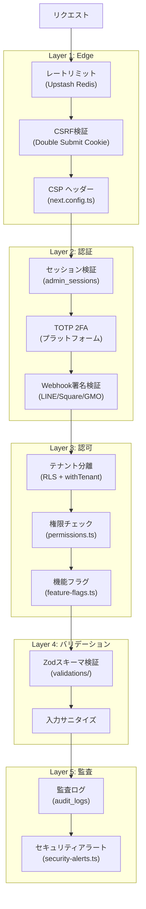

# アーキテクチャドキュメント — Lオペ for CLINIC

> **最終更新**: 2026-02-27

---

## 目次

1. [システム概要](#1-システム概要)
2. [ER図（主要テーブル）](#2-er図主要テーブル)
3. [患者フロー（コンポーネント図）](#3-患者フローコンポーネント図)
4. [データフロー図](#4-データフロー図)
5. [API層アーキテクチャ](#5-api層アーキテクチャ)
6. [インフラ構成](#6-インフラ構成)
7. [Cronジョブ一覧](#7-cronジョブ一覧)
8. [セキュリティレイヤー](#8-セキュリティレイヤー)

---

## 1. システム概要



---

## 2. ER図（主要テーブル）

```mermaid
erDiagram
    tenants {
        uuid id PK
        text slug UK "サブドメイン"
        text name "クリニック名"
        boolean is_active
        timestamptz created_at
    }

    admin_users {
        uuid id PK
        uuid tenant_id FK
        text username UK
        text password_hash
        text platform_role "tenant_admin / platform_admin"
        timestamptz created_at
    }

    tenant_members {
        uuid id PK
        uuid tenant_id FK
        uuid admin_user_id FK
        text role "admin / owner"
    }

    patients {
        serial id PK
        varchar patient_id UK "例: 20260100001"
        text name
        text name_kana
        varchar tel "normalizeJPPhone適用"
        varchar sex
        date birthday
        varchar line_id
        uuid tenant_id FK
        timestamptz created_at
    }

    intake {
        serial id PK
        varchar reserve_id "予約紐付け"
        varchar patient_id FK "ユニーク制約なし"
        varchar answerer_id "LステップUID"
        varchar line_id
        jsonb answers "問診回答データ"
        date reserved_date
        time reserved_time
        varchar status "null / NG"
        text note "カルテメモ"
        text prescription_menu
        uuid tenant_id FK
        timestamptz created_at
    }

    reservations {
        serial id PK
        varchar reserve_id UK
        varchar patient_id FK
        date reserved_date
        time reserved_time
        varchar status "reserved / cancelled"
        text prescription_menu
        uuid tenant_id FK
        timestamptz created_at
    }

    orders {
        serial id PK
        varchar patient_id FK
        varchar payment_id "Square/GMO決済ID"
        varchar payment_status "pending / paid"
        varchar shipping_status "pending / shipped"
        varchar tracking_number "ヤマト追跡番号"
        integer amount
        jsonb items
        uuid tenant_id FK
        timestamptz created_at
    }

    reorders {
        serial id PK
        varchar patient_id FK
        varchar status "pending / confirmed / paid / shipped / rejected"
        text karte_note "再処方カルテ(SoT)"
        varchar payment_id
        integer amount
        jsonb items
        uuid tenant_id FK
        timestamptz created_at
    }

    line_messages {
        serial id PK
        varchar patient_id FK
        varchar line_id
        varchar direction "incoming / outgoing"
        text message_text
        varchar message_type "text / image / flex"
        uuid tenant_id FK
        timestamptz created_at
    }

    message_templates {
        serial id PK
        text name
        text content
        varchar template_type "text / flex"
        uuid tenant_id FK
        timestamptz created_at
    }

    tag_definitions {
        serial id PK
        varchar name UK
        varchar color
        boolean is_auto
        jsonb auto_rule
        uuid tenant_id FK
    }

    patient_tags {
        serial id PK
        varchar patient_id FK
        integer tag_id FK
        timestamptz assigned_at
    }

    step_enrollments {
        serial id PK
        varchar patient_id FK
        integer scenario_id FK
        integer current_step
        varchar status "active / completed / cancelled"
        uuid tenant_id FK
        timestamptz created_at
    }

    webhook_events {
        serial id PK
        varchar provider "square / gmo / line"
        varchar event_key UK "冪等キー"
        jsonb payload
        timestamptz created_at
    }

    audit_logs {
        uuid id PK
        text action
        text actor
        text target_type
        text target_id
        jsonb details
        uuid tenant_id FK
        timestamptz created_at
    }

    admin_sessions {
        uuid id PK
        uuid admin_user_id FK
        text session_token UK
        timestamptz expires_at
        uuid tenant_id FK
    }

    tenants ||--o{ admin_users : "所属"
    tenants ||--o{ tenant_members : "メンバー"
    admin_users ||--o{ tenant_members : "参加"
    admin_users ||--o{ admin_sessions : "セッション"

    tenants ||--o{ patients : "所属"
    patients ||--o{ intake : "問診(複数可)"
    patients ||--o{ reservations : "予約"
    patients ||--o{ orders : "注文"
    patients ||--o{ reorders : "再処方"
    patients ||--o{ line_messages : "LINE会話"
    patients ||--o{ patient_tags : "タグ"
    patients ||--o{ step_enrollments : "Step登録"
    tag_definitions ||--o{ patient_tags : "タグ定義"
```



---

## 3. 患者フロー（コンポーネント図）

LINE友だち追加から発送までの一連のフローを示します。



### 再処方フロー



---

## 4. データフロー図

### 4-1. Webhook データフロー



### 4-2. 認証・セッションフロー



### 4-3. Cronジョブ実行フロー



---

## 5. API層アーキテクチャ

### ルーティング構造

```
/api/
├── admin/              管理画面API（セッション認証必須）
│   ├── login           ログイン・ログアウト
│   ├── patients/       患者CRUD
│   ├── reservations/   予約管理
│   ├── shipping/       配送管理
│   ├── line/           LINE運用（トーク・友だち・配信）
│   ├── karte/          カルテ管理
│   ├── reorders/       再処方管理
│   └── ...
├── checkout            決済リンク生成
├── cron/               Cronジョブ（Vercel Cron）
├── doctor/             医師API（Basic認証）
├── gmo/                GMO Webhook
├── intake              問診保存
├── line/               LINE Webhook
├── mypage/             患者マイページAPI
├── platform/           プラットフォームAPI
├── register/           患者登録
├── reorder/            再処方申請
├── reservations        予約作成
├── square/             Square Webhook
└── verify/             SMS認証（Twilio）
```

### 認証方式一覧

| エンドポイント | 認証方式 | 備考 |
|-------------|---------|------|
| `/api/admin/*` | セッションCookie + CSRF | admin_sessions テーブル |
| `/api/doctor/*` | Basic認証 | DR_BASIC_USER / DR_BASIC_PASS |
| `/api/platform/*` | セッションCookie + TOTP(2FA) | platform_role = platform_admin |
| `/api/line/webhook` | LINE署名検証 | X-Line-Signature |
| `/api/square/webhook` | Square署名検証 | SQUARE_WEBHOOK_SIGNATURE_KEY |
| `/api/gmo/webhook` | GMO署名検証(SHA256) | 段階導入: ShopPass未設定時スキップ |
| `/api/cron/*` | Vercel Cron認証 | CRON_SECRET |
| `/api/mypage/*` | patient_id Cookie | LINEログイン経由で設定 |
| `/api/register/*` | patient_id Cookie | 登録フロー中に設定 |
| `/api/intake` | patient_id Cookie | 問診フォームから送信 |
| `/api/reservations` | patient_id Cookie | 予約画面から送信 |

---

## 6. インフラ構成



### マルチテナントアーキテクチャ

- **テナント識別**: サブドメイン方式 `{slug}.lope.jp`
- **データ分離**: RLS（Row Level Security）+ `tenant_id` カラム
- **テナント解決**: `middleware.ts` でサブドメインから `tenant_id` を解決
- **クエリフィルタ**: `withTenant(query, tenantId)` を全クエリに適用

---

## 7. Cronジョブ一覧

| ジョブ名 | エンドポイント | 実行間隔 | 排他制御 | 概要 |
|---------|-------------|---------|---------|------|
| Step実行 | `/api/cron/process-steps` | 毎分 | `cron:process-steps` (55秒TTL) | LINEステップシナリオの自動送信 |
| 予約送信 | `/api/cron/send-scheduled` | 毎分 | `cron:send-scheduled` (55秒TTL) | 予約済みブロードキャストの送信 |
| AI返信 | `/api/cron/ai-reply` | 毎分 | `cron:ai-reply` (55秒TTL) | 未返信メッセージのAIドラフト生成 |
| リマインダー | `/api/cron/generate-reminders` | 毎分 | `cron:generate-reminders` (55秒TTL) | 予約リマインダーのLINE送信 |
| フォローアップ | `/api/cron/followup` | 毎分 | `cron:followup` (55秒TTL) | 来院後フォローアップメッセージ |
| セグメント再計算 | `/api/cron/segment-recalculate` | 1時間 | `cron:segment-recalculate` (55秒TTL) | 患者セグメントの再分類 |
| 使用量チェック | `/api/cron/usage-check` | 1時間 | - | テナント使用量の集計 |
| 監査アーカイブ | `/api/cron/audit-archive` | 日次 | - | 古い監査ログのアーカイブ |
| ヘルスレポート | `/api/cron/health-report` | 日次 | - | システムヘルスレポート生成 |
| LINE統計 | `/api/cron/collect-line-stats` | 日次 | - | LINE配信統計の収集 |

---

## 8. セキュリティレイヤー



### セキュリティ対策一覧

| 対策 | 実装 | 適用範囲 |
|------|------|---------|
| レートリミット | `lib/rate-limit.ts` (Upstash Redis) | 管理API全般 |
| CSRF防止 | `middleware.ts` (Double Submit Cookie) | 管理API（患者API除外） |
| CSP | `next.config.ts` ヘッダー | 全ページ |
| セッション管理 | `lib/session.ts` + `admin_sessions` | 管理画面 |
| 2FA (TOTP) | `lib/totp.ts` | プラットフォーム管理者 |
| 入力検証 | `lib/validations/` (Zod v4) | 全API |
| 監査ログ | `lib/audit.ts` (fire-and-forget) | 全ドメイン |
| 暗号化 | `lib/crypto.ts` (AES) | 設定値の保存 |
| Webhook署名 | LINE/Square/GMO各SDK | Webhookエンドポイント |
| RLS | Supabase PostgreSQL | 全テーブル |
| 分散ロック | `lib/distributed-lock.ts` (Redis) | Cronジョブ |
| 冪等性 | `lib/idempotency.ts` + `webhook_events` | Webhook処理 |

---

## 関連ドキュメント

- [ドメイン境界マップ](./domain-boundaries.md) — ドメイン責務・SoTテーブル・CRUD権限
- [セキュリティ運用](./security-operations.md) — セキュリティ運用ガイド
- [インシデント対応](./incident-response.md) — インシデント対応フロー
- [データ保護ポリシー](./data-protection-policy.md) — 個人情報取り扱い
- [SLA](./sla.md) — サービスレベル合意
